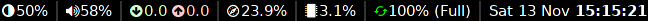

# Rust Blocks

**A lightweight i3/sway status bar written in Rust.**

[](LICENSE)
[](https://gitlab.com/lewisbelcher/rs-blocks/pipelines)
[](https://crates.io/crates/rs-blocks)



## Background

Linux window managers / compositors such as [`i3`](https://i3wm.org/) and
[`sway`](https://swaywm.org/) allow the specification of a command for
generating the status bar. There are many alternatives available but they often
seem to be unnecessarily complex or surprisingly resource hungry, so here is an
implementation that is neither of those things.

NB this project is quite highly tuned for my own setup. If you run into problems
please open an issue!

See the [i3bar protocol](https://i3wm.org/docs/i3bar-protocol.html) for details
on the protocol.

## Installation

1. [Get Rust](https://www.rust-lang.org/tools/install)
1. Clone this repo (optional)
1. Run `cargo install --path <repo path>` (if you did step 2) or
   `cargo install rs-blocks`
1. Use `rs-blocks`! (See `rs-blocks --help` for options)

## Configuration

`rs-blocks` will look for `$XDG_CONFIG_HOME/rs-blocks/config` for a config file.
Alternatively, a config file can be specified by using the argument
`--config`/`-c`.

Config files should be in [toml format](https://github.com/toml-lang/toml). The
section title must match an available block type, and the remaining config
within each section will be used to configure that block.

A basic config file looks like:

```toml
[memory]

[cpu]

[battery]

[time]
```

Multiple entries of the same block can be given as long as they specify
different `name`s. E.g.:

```toml
[time]
name = "time1"
format = "%D"

[time]
name = "time2"
format = "%S"
```

Blocks will appear in the order they are given in the config file, with the
topmost sections appearing as leftmost entries in the status bar.

Available blocks are:

- Battery
- Brightness
- CPU
- Memory
- Network
- Time
- Volume (using `pulsemixer`)

See the documentation under `src/blocks/` for more details on each block.

## Signals

Some blocks will listen for signals to trigger updates immediately. This gives
immediate feedback on the status bar when using keyboard shortcuts to change the
brightness, for example. The current blocks implementing this are:

- Brightness
- Volume

In these cases the signal to listen for can be specified using the block's
`update_signal` value in the config file. In the window manager / compositor
configuration, the sending of this signal will need to be added to the relevant
event. In `sway` for example, this may look like:

```txt
bindsym XF86MonBrightnessUp exec brightness +10 && pkill -SIGUSR1 rs-blocks
```

and corresponding config section:

```toml
[brightness]
update_signal = 10 # SIGUSR1 is 10 on most Linux system
```

More information on signals can be found in the Linux
[man pages](https://www.man7.org/linux/man-pages/man7/signal.7.html).

## Implementation Details

- Most blocks read information from kernel files (`/proc/*` or `/sys/class/*`).
  This might cause issues for some Linux distributions. So far it's been tested
  only on `alpine` and `arch`.
- Blocks are represented by infinite loops in threads sending `(name, text)`
  tuples through a channel, received (and then published) on the main thread.
- The trait `Configure` is used to configure a block based on the configuration
  file (toml string is passed as the config argument). This trait must be
  implemented for all blocks.
- The `Sender` trait should be implemented for creating a message sending
  function (see these traits for details).
